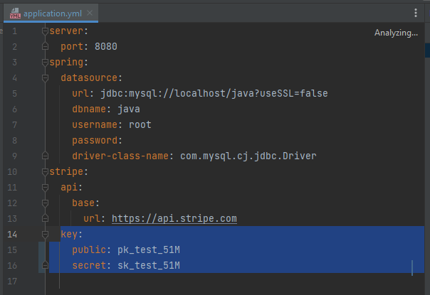

# Stripe: Payment Method
[](https://github.com/lnxxxxxxxx/stripe2/stargazers)

## 💡 Get help - [Documentation](https://github.com/lnxxxxxxxx/stripe2/discussions/categories/q-a)

<hr/>

Stripe is a project based on creating a REST API consuming the official Stripe API, with Springboot/Java technologies ready to be consumed with 3 endpoint inputs.

<hr/>

## 🚀 Features
- 🌐 Access to StripeAPI for searches and information gathering
- ⚡ Quick and efficient management of requests
- 🗃️ Data storage in database

## 📋 Requirements

- Environment 
  - [IntelliJ IDEA](https://www.jetbrains.com/idea/download)
  - [Java17 or later](https://www.oracle.com/ar/java/technologies/downloads/)
  - [MySQL or other](https://www.apachefriends.org/download.html)
  - [Postman](https://www.postman.com/product/rest-client/)
- [Stripe API Key](https://stripe.com/)

## ⚠️ Stripe API Keys Configuration ⚠️ 

Obtain your Stripe API key from: https://dashboard.stripe.com/test/dashboard.

To use the Stripe API key, you **NEED** to be set to developer mode.

You can set up a paid account.

For Stripe API Key to work, set your **.yml** to Stripe's key



#### **PLEASE ENSURE YOU HAVE DONE THIS STEP BEFORE PROCEEDING, OTHERWISE NOTHING WILL WORK!**

## 💾 Installation

To install Stripe, follow these steps:

1. Make sure you have all the **requirements** listed above, if not, install/get them


2. Clone the repository – For this step, you need to have Git installed. Alternatively,
   you can download the [latest stable version] (https://github.com/lnxxxxxxxx/stripe2) (`Source code (zip)`, at the bottom of the page).

    ```bash
    git clone https://github.com/lnxxxxxxxx/stripe2.git
    ```

3. Open Stripe with IntelliJ Idea and wait for the dependencies to install.
4. Set up Stripe
   1. Locate the file named `.yml` in the `/resources` folder.
   2. Open the `.yml` file in the editor.
   4. Find the line that says ` key > public and secret`.
   5. After `":"`, enter your Stripe API keys (without quotes or spaces).
   6. Enter the data from your database.
   7. Save and close the `.yml` file.

   By completing these steps, you have successfully configured the API and database keys for your project.
   
   
## 🔧 Usage

1. Run your Xampp and then springboot:maven:run from the right menu of IntelliJ IDEA, named maven.


2. Open Postman
   1. On the first ``payment/paymentintent`` endpoint in a json send the POST request
``{ "amount" : "9999",
"currency" : "USD",
"description" : "PC-Gamer" }``.
All the data will be saved in the database and it will remain as Pending Payment and a json will be returned to you and an ID inside, save it.

   2. On the second ``payment/confirm/{id}`` endpoint
In the id you must put the previous ID and send the POST request, confirmed the payment will be made successfully and it will be updated in the Date and Successful Payment database.
   3. In the third endpoint ``payment/cancel/{id}`` put the aforementioned ID, POST request, and the payment will be canceled, updating the data as Cancelled.
   
## 🔎 Run tests

It only has one test currently, it is controller, it is done to validate the requests.
This code uses the ``@RunWith(MockitoJUnitRunner.class)`` annotation to indicate that Mockito functions will be used in tests, and the `@InjectMocks` and `@Mock` objects to inject the necessary mocks.

The init() method sets up the mockMvc object that will be used to make mock HTTP requests.

The three tests are defined below:

1. paymentTest() – Simulates a request to create a PaymentIntent via POST to `/paymentintent` and verifies that an HTTP 200 response is received and that the JSON of the response contains the expected values.

2. confirmTest() – Simulates a PaymentIntent confirmation request by sending POST to `/confirm/{id}` and verifies that an HTTP 200 response is received and that the JSON of the response contains the expected values.

3. cancelTest() – Simulates a request to cancel a PaymentIntent by sending POST to `/cancel/{id}` and verifies that an HTTP 200 response is received and that the JSON of the response contains the expected values.

In each test, Mockito's when() function is used to indicate what value the mock should return.

